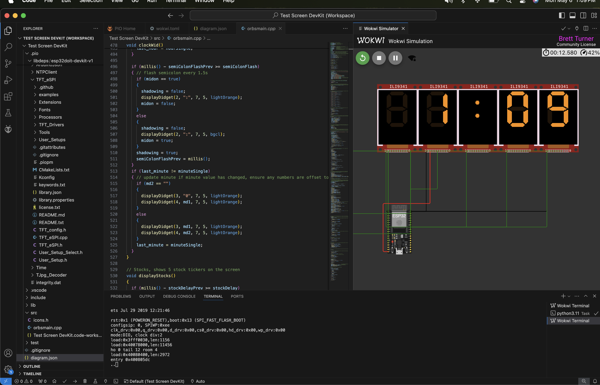

# Welcome to Info Orbs!

Info Orbs is a low cost, open source, multi-use desktop widget that can be used for things like time, weather, sports score, stock prices, notifications & much more!

Quick Links: [Trello](https://trello.com/b/R8soU39O) | [Discord](https://discord.gg/xZhYuQ9y64) | [Brett (:](https://bturner.tech/links)

    
    
    

## First, a few housekeeping items for anyone interested in helping with this project, or building one for themselves

- If you want to contribute and or need a hand with setup, please pop over to the  [Discord](https://discord.gg/xZhYuQ9y64).  Come say hi in the "io-general" channel and you'll be given access to all of the info orbs channels (:.
- The soldering/wiring on this is tricky, I'm currently in the process of building out dev kits that will a custom PCB and all needed parts. Those will be available in the next 1-2 weeks.
- The code base currently consists of two branches:
	- The main branch, which is written using very elementary/inefficient code. This code is entirely functional and will display 	 3 widgets; A clock, a weather widget, and a stock price tracker widget.
	- A nightly branch, so far written primarily by @brammie15, this branch is written in a much more efficient object oriented codebase. While still a work in progress, the goal is to eventually get this code base caught up with the functionality of the main codebase and use this as the basis to develop the orbs moving forward assuming everyone likes the layout/structure.

Lastly, some little things things that will make development allot easier:

1. [A Trello Board](https://trello.com/invite/b/R8soU39O/ATTIeb8e4050b33b9b350e3a622ce4c54ee4E407E48C/info-orbs-mega-board), where current projects/tasks are tracked as well as a large list of potential ideas.
2. A simulated dev environment so that will allow you to simulate/test your code without needing hardware. (See below for setup)

## Getting Up And Running

### 1. Hardware/Wiring 
**Component List:**
_one again full dev kits with all needed components & a custom PCB are coming very soon, I advise waiting for these_
- [240x240 TFT displays](https://s.click.aliexpress.com/e/_DmZVAIL) x 5
- ESP32 x2 - I use [this 38 pin dev board](https://s.click.aliexpress.com/e/_DdEtAHN) for this project, however any ESP32 _should_ work. 
- Any momentary button x1

**Pinouts/Wiring Diagram** 
Each display will have have 5 pins that will all go to/share the same output pins on the ESP, effectively wired in series. Those pins are as follows

    DSP-----ESP
    SDA -> G17 
    SCLK -> G23 
    DC -> G19 
    RST -> G18
    VCC - >5V/VCC 
    GND -> GND

Each screen will have its own unique `CS` pin on the ESP32. The CS pin numbers for each screen, from left to right are

    Screen1 CS -> G13
    Screen2 CS -> G33
    Screen3 CS -> G32 
    Screen4 CS -> G25
    Screen5 CS -> G21
   
   Lastly, wiring up a single pushbutton between `VCC/5V` and `G26`

Diagram can be seen below: 

### 2. Dev Environment Setup/Project Config
**IDE Setup**
While built on Arduino, the codebase for this project has been built using the  [Platform IO IDE](https://platformio.org/), which allows you to compile/run Arduino code in VSC, as well as quite a few other creature comfort items.
Once you have platform.io installed and configured in VSC, you'll want to select "Open Project", and select & open the main "Info-Orbs" directory.

**Project Configuration**
(all of these items apply only to bretts code on the main branch, the nightly config is slightly different)

Before compiling/flashing, you'll want to adjust a few parameters in src/main.cpp:

    String weatherLocation = "[CITY,STATECODE]" <- ex. Victoria,BC
    String weatherUnits = "[UNITS]";         <-  Units for weather "us" for F,  "metric" for C
    const char *ssid = "[YOUR WIFI USER NAME HERE]";
    const char *password = "[YOUR WIFI USER NAME HERE]"
    
The code should now compile and flash to your ESP if you used the pins/wiring as laid out in the diagram(or have a dev kit).

**If you need/want to use different pins they can be configured in two places:**
For the main screen pins in Info_Orbs/platformio.ini (MOSI == SDA):

    -D TFT_MOSI=17
    -D TFT_SCLK=23
    -D TFT_DC=19
    -D TFT_RST=18

For the CS pins in src/main.cpp(screens left to right:

    int pins[]{13, 33, 32, 25, 21};    

### 3. Virtual Hardware Simulation 

Included in the GitHub is a preconfigured [Wokwi simulator](https://wokwi.com/) to help you quickly prototype your code. Setup requires a few brief steps:
1. Set up a Wokwi account at wokwi.com.
2. Install the Wokwi VSC extension. 
3. Generate a free license key via the VSC extension as outlined here: https://docs.wokwi.com/vscode/getting-started

Lastly, you will need to change two config settings in order to have your codebase work with the simulator:

1. In  "Info_Orbs/platformio.ini", comment out `-D GC9A01_DRIVER` and uncomment `-D ILI9341_DRIVER` (the displays available in the wow are different than the live hardware
2. In src/main.cpp, set your wifi credential to be: `u:"Wokwi-GUEST" p:""` (this is what they are by default in the sketch).

You will now be able to run simulation hardware by opening the "diagram.json" in VSC!! Wooo!!!
## Codebase Nice-To-Knows
I wont spend to much time writing this as it will likely entirely chance once we roll out the new codebase, but a few notes on how the screens work:

Screen are driven primarily using the [TFT_eSPI library](https://github.com/Bodmer/TFT_eSPI).

It might seem odd how the displays are wired together in parallel; you'd thin they would show same things as they are getting the same data right? Well....kind of....this is where the CS pin comes in. Each screen has its own unique CS pin.

The CS pin stands for "Chip Select" and it effectively turns the screen's data lines on and off whether it's pulled low (on) or high(off). This means that even if all of the screens are receiving a stream of data, we can set all but one of the screens CS pins to low, which will only allow that screen to have data written into it. We are able to display images on multiple screens by manually managing this CS pin.

## Contributors
A massive thank you to the community that has helped, this is my first open source project(honestly first project of any sort) so thy help of all you super smart people has just been so so incredible and I couldn't have got this anywhere near where it is now without everyone. Thanks for building this with me. Love ya'll! ♥️

