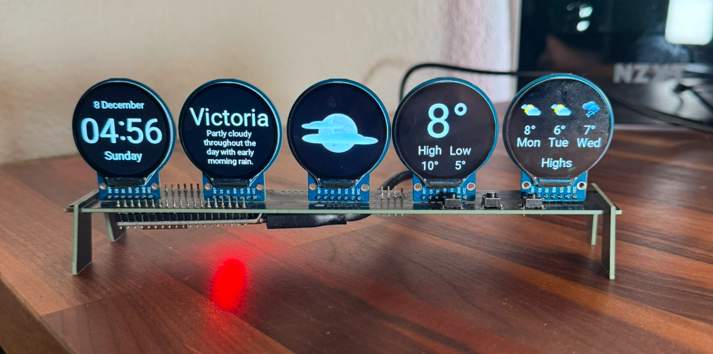
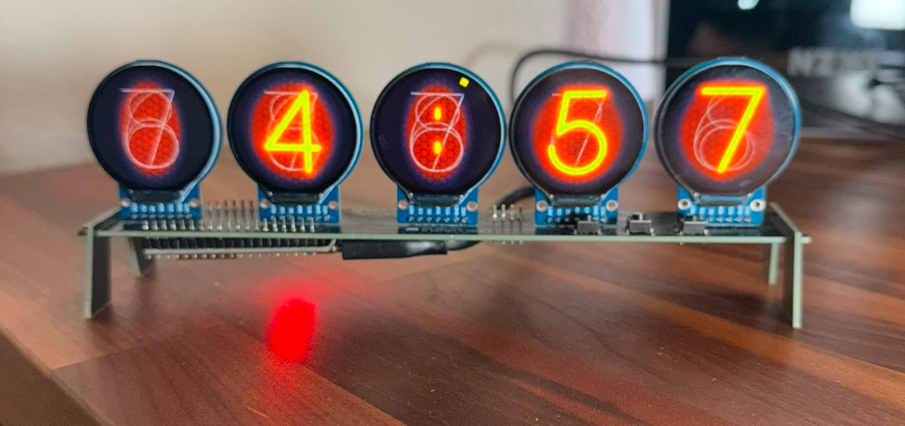
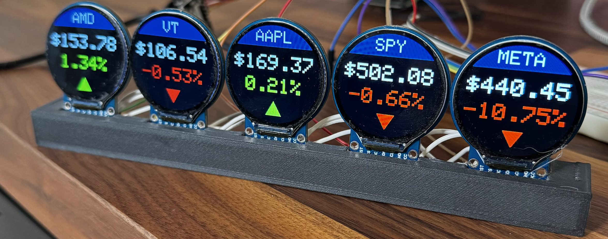

# Welcome to Info Orbs
Info Orbs is an open source display widget built on top of the ESP32 platform. The device can be used to display a variety of different widgets catered to many different use cases (:

**Version 1.1 of the firmware is here, you can find the new features outlined below. If you're coming from Youtube, the software flashing instructions have changed slightly, *please refer to *[the NEW FLASHING INSTRUCTIONS](references/Firmware%20Install%20Guide.md)* to ensure you get up and running smoothly.***

Quick Links: [Get A Dev Kit Here](https://brett.tech/collections/electronics-projects/products/info-orbs-full-dev-kit) | [Discord](https://link.brett.tech/discord) | [Youtube Assembly/Flashing Video](https://link.brett.tech/orbsYT)
<p>
    
    
    
</p>

## First, a few housekeeping items for anyone interested in helping with this project, or building one for themselves

- If you want to contribute and or need a hand with setup, please pop over to the [Discord](https://link.brett.tech/discord). Make sure to select you're there for info orbs when filling out the onboarding questionnaire in order to get placed in the right channels

- I've put together dev kits consisting of all the parts you need to build this project [you can buy them here.](https://brett.tech/collections/electronics-projects/products/info-orbs-full-dev-kit)  They're $60 and will save you a bunch of time and hassle, and are a great way to support the project (:

- I've put together a brief [Youtube Video](https://link.brett.tech/orbsYT) walking through the soldering and flashing for anyone that needs a hand assembling.
## Version 1.1 Release

Version 1.1 is here, in the future releases will be more frequent, but this one is a BIG one bringing some incredible functionality to the project.

**1.1 Changes:**


 1. WifiManager added allowing users to configure/change their Wifi credentials using a friendly in-browser portal.
 2. TTF fonts, giving us much more flexibility in the fonts we use and how they're scaled.
 3. Updated Stock widget with a new look and now supporting international markets, different currencies, crypto and forex.
 4. Nixie Tube clock
 5. Support for users to create their own clocks by simply uploading images for digit
 6. Weather widget "dark mode"
 7. Widget auto-scrolling (switch between widgets automatically ever x seconds)
 8. Screen "Dimming" during certain hours of the day. This is artificial dimming through way of adjusting the colours to be less saturated, but it works very well.
 9. Medium & long press button support to allow for further on device configurations
 10. MQTT widget introduced to display data from and MQTT broker, with a [home assistant blueprint available](https://github.com/dreed47/info-orbs-mqtt-ha).  
 11. Multi Language support for the weather widget

 ..plus LOTS more, this was a big one, thank you to all of the community members who made this update happen. I'm excited we get to finally roll it out and share it with you.
## Getting Up And Running

### 1. Hardware/Wiring
If you use the PCB soldering should be straight forward, however if you want to wire thing up yourself the pinouts are below:

    DSP-----ESP
    SDA -> G17 
    SCLK -> G23 
    DC -> G19 
    RST -> G18
    VCC - >5V/VCC 
    GND -> GND
    Screen1 CS -> G13
    Screen2 CS -> G33
    Screen3 CS -> G32 
    Screen4 CS -> G25
    Screen5 CS -> G21

   Lastly, three pushbuttons between `VCC/5V` and `G14,G26,G27.`
Diagram can be seen below:


### 2. Dev Environment Setup Config
**IDE Setup**
Start by downloading the most recent codebase from the `main` branch. Should you want to explore the latest and greatest features, you can try flashing the `dev` branch by changing the dropdown at the top left, however this version will be poorly documented and less stable.
While built on Arduino, the codebase for this project has been built using the  [Platform IO IDE](https://platformio.org/), which allows you to compile/run Arduino code in VSC as well as quite a few other creature comfort items.
Once you have platform.io installed and configured in VSC, open the `info-orbs.code-workspace` to being the setup process.

**Project Configuration**
Before compiling/flashing, you'll need to navigate into `firmware` >>`config` directory and make a copy of the file `config.h.template` in the same folder and rename that copy to `config.h` **THIS STEP IS CRITICAL AND YOUR CODE WILL NOT COMPILE IF YOU DONT COPY THIS FILE AND CHANGE THE NAME**

Lastly, open up the `config.h` file you just copied/renamed and adjust the parameters in this file to configure the orbs to your personal needs. You can find more details about each configuration option below.

Once you're done this, you can flash the firmware to your orbs by holding the "boot" button on the ESP32 and clicking the "Upload" arrow at the very bottom bar of VSC.

### 3. Widget Options & Configuration
**Basic Setup Fields**
- Wifi is now configured on device using WifiManager by connected to the devices access point upon boot. However if this does not work, you may manually configure your wifi details using the fields in the config file (only do this as a last resort.)  
  ```c
  //#define WIFI_SSID "MyWiFiRouter" // Wifi router SSID name (use only 2.4 GHz   network)    
  //#define WIFI_PASS "WiFiPassword" // Wifi router password  
  ```
- Timezone configuration, you will need to change the below field to your local timezone, or timezone you want displayed on the devices clock(s). Please copy/paste the exact timezone as outline in this list <https://timezonedb.com/time-zones>  
  ```c
  #define TIMEZONE_API_LOCATION "America/Vancouver" // Use timezone from this   list: https://timezonedb.com/time-zones
  ```

- If you want your orbs to automatically cycle widgets, you can change the number from 0 in the below line of code for how many seconds you want to wait between switching, and this will enable that functionality
  ```c
  #define WIDGET_CYCLE_DELAY 0 // Automatically cycle widgets every X seconds, set   to 0 to disable
  ```

- If you want your orbs to "dim" at certain hours of the day you need to uncomment (remove the `//`  at the beginning of the below three lines of code then adjust the starting hour, ending hour, and brightness which you want the dimming to occur.
  ```c
  //#define DIM_START_HOUR 22  // Dim the screens at this time (24h format)
  //#define DIM_END_HOUR 7     // Undim the screens at this time (24h format)
  //#define DIM_BRIGHTNESS 128 // Dim brightness (0-255)
  ```

**Widgets & Widget Settings**
1. **Clock** (Enabled By Default) - this will show the time on the orbs with multiple means of customization. The default settings for the clock will switch between the default and "nixie" style clock upon a short press of the middle button. It will switch between 12/24 hours by a medium press(~0.5 seconds) of the same middle button. The clock has many other configureable elements that can be found in config.h as shown below, feel free to mess around with them to make it your own (:
   ```c
   // CLOCK CONFIGURATION
   # define FORMAT_24_HOUR false            // Toggle 24 hour clock vs 12 hour    clock, change between true/false
   # define SHOW_AM_PM_INDICATOR false      // AM/PM on the clock if using 12   hour
   # define SHOW_SECOND_TICKS true          // Ticking indicator on the centre   clock
   # define CLOCK_COLOR 0xfc80              // Orange for clock
   # define CLOCK_SHADOW_COLOR 0x20a1       // Clock shadow color (Light brown)
   # define CLOCK_SHADOWING true            // Use clock shadow (set to false   to   disable)
   # define USE_CLOCK_NIXIE true            // Set to true to enable Nixie   style   clock
   # define USE_CLOCK_CUSTOM false          // Set to true to enable custom   clock  (see images/ClockWidget/custom/README.md)
   //#define CLOCK_NIXIE_COLOR 0x001f        // Override Nixie color
   # define DEFAULT_CLOCK ClockType::NORMAL // Set the default clock face:       ClockType::NORMAL, ClockType::NIXIE or ClockType::CUSTOM
   //#define CLOCK_FONT DSEG7              // Define clock font (defaults to   DSEG7,    you can also try DSEG14 or FINAL_FRONTIER)
   ```

2. **Weather** (Enabled By Default) - This will show the weather as defined by your weather location. Short pressing the middle button will toggle between the forecast displaying high/low temps, you can also adjust things like your unit preference and whether you want the "theme" to be dark or light (check out both, they're quite different)
   ```c
   #define WEATHER_LOCATION "Victoria, BC" // City/state for the weather, look it    up on https://www.visualcrossing.com/weather-data
   # define WEATHER_SCREEN_MODE Dark        // Can be either Light or Dark
   # define WEATHER_UNITS_METRIC            // Comment this line out (or delete it)    if you want imperial units for the weather
   ```

3. **Stocks** (Enabled By Default) - This will show 5 pre-defined stocks, their prices, names, daily change, and 52 weeks highs/lows. Pressing the middle button will refresh the prices, they will otherwise update automatically every 15 minutes
There are multiple markets/exchanges supported including crypto and forex, the data for this widget is supplied by twelve-data, info on what data you can pull can be found here: <https://twelvedata.com/exchanges?level=grow>.
Simply adjust the 5 stocks in the config file to change the ones you'd like to track, separated by commas.
- To pull a stock from an international market you may add `&country=Germany` (or which ever country you prefer) to identify your local exchange
- If you're displaying forex or crypto, ensure to include `/USD` (or your given currency) as this will be needed to display the price.
`#define STOCK_TICKER_LIST "BTC/USD,USD/CAD,XEQT,SPY,APC&country=Germany" // Choose 5 securities to track. You can track forex, crypto (symbol/USD) or stocks from any exchange (if one ticker is part of multiple exchanges you can add on "&country=Canada" to narrow down to your ticker)
`

4. **parqet.com** (Disabled By Default) - A popular financial portfolio tracker in Germany, this widget will give you a beautiful real-time display of your data. To enable, remove the `//` in front of the config line, and enter your portfolio ID in-between the `""`
`//#define PARQET_PORTFOLIO_ID "" // set the id of your parqet.com portfolio. Make sure the portfolio is set to public!
`

5. **Dynamic Web Data** (Disabled By Default) [advanced users only]- This widget will allow you to make your own custom widget defined by a JSON payload. Further documentation to come.
   ```c
   //#define WEB_DATA_WIDGET_URL "" // Use this to make your own widgets using an    API/Webdata source
   ```


And thats it, goodluck & happy orbin (:


## Contributors
A massive thank you to the community that has helped, this is my first open source project(honestly first project of any sort) so thy help of all you super smart people has just been so so incredible and I couldn't have got this anywhere near where it is now without everyone. Thanks for building this with me. Love ya'll! ♥️

<a href="https://github.com/brett-dot-tech/info-orbs/graphs/contributors">

</a>

